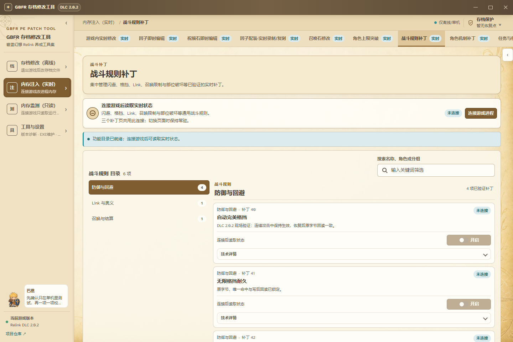
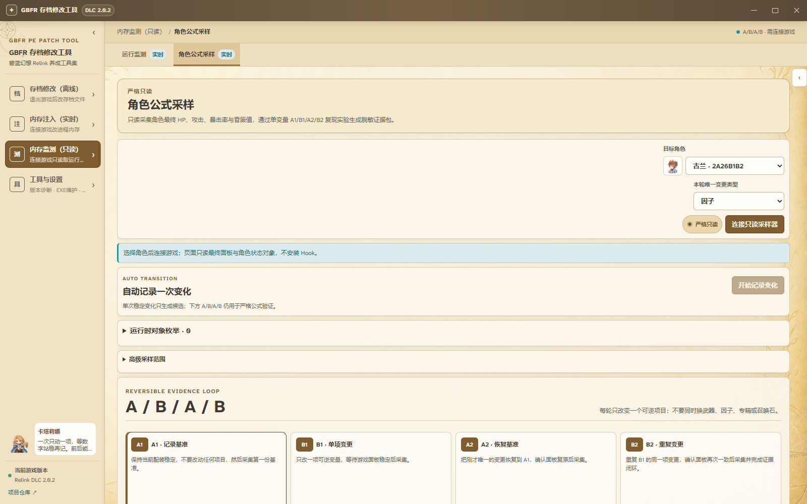

<p align="center">
  
</p>

<h1 align="center">GBFR PE Patch Tool</h1>

<p align="center">
  《碧蓝幻想：Relink》DLC 2.0.2 Windows 工具：编辑存档与配装、修改游戏内数据、启用单机补丁、监测角色面板。
</p>

<p align="center">
  <a href="https://github.com/Whitelinker574/GBFR-PE-Patch-Tool/releases/latest"><strong>下载 v1.91.13</strong></a> ·
  <a href="README_EN.md">English</a> ·
  <a href="docs/README.md">文档索引</a>
</p>

<p align="center">
  <a href="https://github.com/Whitelinker574/GBFR-PE-Patch-Tool/actions/workflows/ci.yml"></a>
</p>

> 适用游戏版本：DLC 2.0.2。修改前保留备份；实时功能仅用于本地单人游戏。

## 先选你要做的事

| 你的目标 | 进入哪里 | 游戏状态 |
| --- | --- | --- |
| 批量添加因子、祝福、物品、武器或召唤石 | `存档修改（离线）` | **完全退出游戏** |
| 查看或写入角色配装预设 | `存档修改（离线）` → `配装预设（查看与写入）` | **完全退出游戏** |
| 修改游戏里当前选中的因子、祝福石或召唤石 | `内存注入（实时）` | **启动游戏并进入存档** |
| 开启格挡、角色机制、任务便利等补丁 | `内存注入（实时）` → 对应补丁页 | **启动游戏并进入单机内容** |
| 查看队伍状态或校准角色最终属性 | `内存监测（只读）` | **启动游戏并进入稳定场景** |
| 检查版本、备份或恢复游戏 EXE | `工具与设置` | 按页面提示 |

离线、实时、只读是三套不同工作流。离线页面修改存档文件；实时页面连接当前游戏进程并写入；只读页面不改变角色、物品或存档数据。公式采样器只查询和读取内存；运行监测为捕获当前选中物品会临时安装只读地址 Hook，并在安全断开或离开页面时恢复原字节。

## 下载与首次使用

1. 从 [Releases](https://github.com/Whitelinker574/GBFR-PE-Patch-Tool/releases/latest) 下载 Windows amd64 压缩包，解压后运行 `GBFR PE Patch Tool.exe`。
2. 先在首页按上表选择工作区。离线编辑前退出游戏；实时和只读功能先启动游戏并进入存档。
3. 写入前核对存档位、角色、物品和槽位。页面提示成功后，再用回读结果或游戏界面确认。
4. 修改存档前可点窗口右上角“存档保护”创建恢复点；修改游戏 EXE 前在“游戏文件维护”创建 `.bak`。遇到错误先停止继续写入，按 [故障排查](#出问题先看这里)处理。

默认存档目录：

```text
C:\Users\<用户名>\AppData\Local\GBFR\Saved\SaveGames\
```


**这张图看什么：** 左侧四个工作区决定工具采用离线写入、实时写入还是只读模式。先根据游戏当前是否运行选择工作区，再从首页功能卡进入具体页面。

## 完整功能

### 存档修改（离线）· 7 页

使用这些页面前先完全退出游戏。程序会分别列出存档位 1 / 2 / 3，也可以用“浏览…”选择文件；不要默认第一个就是目标存档。

| 页面 | 可以做什么 | 操作要点 |
| --- | --- | --- |
| 配装预设（查看与写入） | 查看每个角色保存的武器、12 个因子、4 个技能和专精；写入或分享单套配装 | 导入时独立生成 12 个因子，补建缺失召唤石，并同步专精等级、角色强化和武器强化/祝福；缺少对应武器时锁定保存 |
| 因子修改（存档修改） | 生成（即添加）、批量管理和删除存档因子 | 配置因子与词条；组合检查只提醒，不替你改变选择 |
| 物品与武器（存档修改） | 修改物品、素材、养成资源和武器等级 | 适合批量修改；写入后检查自动备份和回读 |
| 祝福修改（存档修改） | 生成（即添加）祝福并设置三条词条 | 核对三条词条、等级提示和写入队列 |
| 召唤石添加 / 修改（存档） | 新增召唤石，或原子修改已有记录的种类、加护、词条、等级与状态 | 换种类时生成新 SlotID 并迁移已装备引用；工具不替存档强开 DLC 系统；写后重新读取验证 |
| 角色使用次数 | 查看并批量修改所选角色的使用次数 | 只保存勾选角色，写入前检查选择数量 |
| 任务与称号记录 | 修改任务完成次数、称号解锁和已查看状态 | 称号奖励领取记录保持不变 |

### 内存注入（实时）· 10 页

先启动游戏、进入存档，再从页面连接游戏进程。重新进档、重启游戏或目标列表刷新后，应重新连接或重新选择目标。

| 页面 | 可以做什么 | 操作要点 |
| --- | --- | --- |
| 游戏内实时修改 | 修改金币、药水、素材消耗和任务掉落等运行时数据 | 连接后按资源或任务分类操作；重启游戏后需重新连接 |
| 因子即时编辑 | 修改游戏中当前选中的因子 | 打开游戏内因子列表并选中目标 → 回工具刷新并核对 → 写入 |
| 祝福石即时编辑 | 一次事务写入当前祝福石的三条词条 | 打开祝福石列表并选中目标；写入后须回游戏重新选中 |
| 因子配装·实时录制/复刻 | 记录 12 个因子并导出；把配装逐项复刻到备用因子 | 从第一项开始逐项移动，不要快速滚动；会改写备用因子 |
| 召唤石修改 | 修改背包中召唤石的因子、副参数和等级 | 先打开召唤石背包并选中目标；本页不提供更换召唤石种类的安全写入 |
| 角色上限突破 | 读取并修改突破结果界面的四个能力槽 | 先在游戏中完成一次 3 级突破，停在结果页再刷新和保存 |
| 战斗规则补丁 | 管理闪避、格挡、Link、召唤限制和部位破坏等补丁 | 仅单机；与下面两页共用常驻连接 |
| 角色机制补丁 | 按角色启用专属机制补丁并显示冲突 | 互斥项先恢复当前功能，再启用另一项 |
| 任务与便利补丁 | 修改任务倒计时、宝箱、结算、支线奖励和养成便利 | 仅单机；任务状态变化后刷新回读 |
| 怪物倍率与伤害记录 | 调整怪物倍率、霸体并记录伤害实验 | 实验功能；先检查当前状态和倍率，再逐项启用 |

战斗规则、角色机制和任务便利三个补丁页共用一条常驻连接。切换页面不会关闭已启用的补丁；选择“恢复全部并断开”或退出程序时才统一清理。

### 内存监测（只读）· 2 页

| 页面 | 可以做什么 | 操作要点 |
| --- | --- | --- |
| 运行监测 | 查看玩家、三名队员、碧的小红龙，以及列表当前选中的素材或关键物品 | 进入稳定场景后连接；选中物品捕获 Hook 会在安全断开或离页时恢复 |
| 角色公式采样 | 连续读取最终 HP、攻击力、暴击率和昏厥值，记录单变量 A/B/A/B 样本 | 每轮只改变一项，等数值稳定后采集；不写进程或存档 |

### 工具与设置 · 3 页

| 页面 | 可以做什么 | 操作要点 |
| --- | --- | --- |
| 版本适配 | 查看工具版本、游戏文件和各功能的适配状态 | 未识别的游戏版本不要强行应用补丁 |
| 语言与显示 | 切换界面语言 | 切换后应用刷新，设置只保存在本机 |
| 游戏文件维护 | 识别游戏 EXE、创建 `.bak` 并恢复 | 先创建原始备份，再应用文件补丁 |

## 三种常用操作

### 修改存档、因子或配装

1. 完全退出游戏。
2. 进入 `存档修改（离线）`，选择需要的功能页。
3. 若显示多个存档位，逐个选择并确认页面读出的角色或内容；也可点“浏览…”指定文件。
4. 选择目标角色、物品或槽位，完成配置后再次核对。
5. 执行写入，确认页面显示备份和回读成功。
6. 启动游戏检查结果；不符合预期时不要继续覆盖。完全退出游戏，点右上角“存档保护”，选择写入前的恢复点并点“恢复到这里”。


**这张图看什么：** “存档位 1 / 2 / 3”是三份独立存档，“浏览…”用于手动选择文件，“刷新”重新读取当前存档。选中存档和角色后，点右侧“编辑 [角色] 配装”进入写入页；已有目标槽会被覆盖。

### 使用实时修改或单机补丁

1. 启动游戏并进入要修改的存档；补丁功能进入单机内容。
2. 进入 `内存注入（实时）`，打开目标页面并连接游戏。
3. 涉及因子、祝福石或召唤石时，先在游戏列表中选中目标，再回工具刷新核对。
4. 只修改当前确认的目标。重新进档或列表刷新后，重新选择目标。
5. 三个补丁页可直接切换，连接和已启用状态会保留。
6. 用完后选择“恢复全部并断开”；重启游戏后实时状态也会失效。



**这张图看什么：** 顶部显示三个补丁页共用的连接状态，功能卡显示启用与回读结果。先点“连接游戏进程”，再逐项启用；结束时点“恢复全部并断开”。

### 读取角色最终面板并采样

1. 启动游戏，进入装备、训练场等数值稳定的场景。
2. 进入 `内存监测（只读）` → `角色公式采样`，选择当前角色并连接。
3. 等 HP、攻击力、暴击率和昏厥值连续稳定，再记录基线。
4. 在游戏中只改变一个可逆项目，等待新值稳定后停止并分析。
5. 需要严格验证时执行 A1/B1/A2/B2；证据不足的结果只会标为候选、负观察或尚未闭环。



**这张图看什么：** 先在右上选择当前角色并点“连接只读采样器”，连接后核对游戏版本、角色和四项最终值。确认无误后点“开始记录变化”；下方 A/B/A/B 只用于更严格的重复验证。

## 出问题先看这里

| 现象 | 先做什么 |
| --- | --- |
| 没找到存档 | 检查默认目录；用“浏览…”手动选择 `SaveData*.dat` |
| 显示三个存档，不知道选哪个 | 不要按顺序猜；逐个选择，根据页面读出的角色、配装或记录确认目标 |
| 实时页面显示未连接 | 确认游戏已启动并进入存档，然后在当前页面重新连接 |
| 提示目标失效、指针为空或记录变化 | 回到游戏重新选中目标，返回工具刷新后再写入 |
| 切换补丁页后看不到连接 | 三个补丁页应共享连接；查看顶部连接状态，不要重复启动多个连接 |
| 游戏版本或 EXE 未识别 | 停止应用文件补丁；到 `工具与设置` → `版本适配` 查看各功能状态，确认 DLC 2.0.2，必要时用 Steam 验证文件 |
| 存档还未开放召唤石或专精系统 | 默认可写入存档中已经存在的预分配字段，但这不会替游戏解锁系统；启动游戏后仍以游戏实际开放状态为准 |
| 组合检查提示异常 | 提示不会阻止写入，但游戏可能拒绝、清理或不显示该数据；先保留备份 |
| 写入后结果不对 | 停止继续写入并完全退出游戏；点右上角“存档保护”→ 选择写入前恢复点 →“恢复到这里” |
| 游戏 EXE 补丁需要撤销 | 到 `工具与设置` → `游戏文件维护` 恢复 `.bak`；也可使用 Steam 文件验证 |

## 数据与准确性

- 因子、祝福和召唤石在存档、实时和配装入口共用 DLC 2.0.2 目录；目录一致不代表任意组合都会被游戏接受。
- 配装页分项展示存档可证明的成长、武器、因子、专精、上限突破和召唤石来源。
- 单套配装文件复制武器引用及其强化、觉醒/超凡和祝福，12 个独立因子、技能、专精选择与专精等级、角色强化进度和全局召唤石；目标存档缺少的召唤石会自动补建。系统开放状态和角色上限突破保留目标存档原值，缺少对应武器时拒绝部分写入。
- 未获得足够实机证据的数值继续标为估算、候选、负观察或尚未闭环，不作为最终公式。
- 只读证据导出会移除 PID、模块基址、绝对地址、用户名和本地路径，不导出整段进程内存。

详细说明见 [公式与证据等级](docs/FORMULAS_2.0.2.md)、[公式采样操作说明](docs/角色公式采样操作说明.md)、[存档/内存目录一致性](docs/evidence/save-memory-table-parity.md) 和 [实现状态](docs/IMPLEMENTATION_STATUS.md)。

## 文档与开发

- [文档索引](docs/README.md)：按用户、维护者和证据资料分类
- [项目架构](docs/ARCHITECTURE.md)：前后端边界与数据流
- [后端文件索引](internal/backend/README.md)：按功能域查找 Go 文件
- [脚本说明](tools/README.md)：仓库内每个维护脚本的用途和入口
- [第三方组件说明](THIRD_PARTY_NOTICES.md)：依赖、来源和边界

<details>
<summary><strong>项目结构与本地构建</strong></summary>

```text
internal/backend/   Go 后端：存档、运行时、目录与测试
frontend/           Vue 界面、前端测试与 Wails 绑定
src_dll/            patch_core 原生组件源码
tools/              数据审计、目录生成和发布维护脚本
docs/               使用说明、架构、截图与脱敏证据
build/              Wails 元数据、图标和本地构建输出
.github/workflows/  持续集成与发布检查
```

构建环境：Windows amd64、Go 1.25+、Node.js/npm、Wails CLI v2.13、WebView2 Runtime。只有重建 `src_dll/patch_core` 时需要 Visual Studio/MSBuild。

```powershell
cd frontend
npm ci
npm run build
cd ..

go test ./...
go vet ./...
node --test frontend/src/*.test.js
wails build -platform windows/amd64 -clean
```

成品位于 `build\bin\GBFR PE Patch Tool.exe`。

</details>

## 反馈问题

在 [Issues](https://github.com/Whitelinker574/GBFR-PE-Patch-Tool/issues) 中说明工具版本、游戏版本、使用页面、目标存档位、操作步骤和实际结果。运行时问题可以附脱敏后的页面状态或证据包；不要上传真实存档、PID、绝对地址、用户名或带有个人路径的截图。

## 使用边界、来源与第三方说明

本项目是非官方工具，仅供学习和个人本地使用，与 Cygames、SEGA、游戏发行方及所列社区作者均无隶属、合作、授权或商业关系。修改存档、游戏文件或运行时内存可能导致数据损坏、进度丢失或触发游戏自身校验；请只处理自己有权使用的文件，保留可恢复备份，并自行承担使用结果。请勿将本项目用于付费代改，或在联机环境中影响其他玩家。

本仓库没有声明一份能够覆盖全部继承代码的项目级开源许可证；除各自明确标注许可的第三方组件外，不能仅因仓库公开就推定获得复制、再分发或商业使用授权。仓库不包含、镜像、破解或转售任何第三方付费表、会员内容或受限下载。

<details>
<summary><strong>来源链与公开资料</strong></summary>

本项目最初 fork 自 [BitterG/GBFR-PE-Patch-Tool](https://github.com/BitterG/GBFR-PE-Patch-Tool)，存档解析、因子与祝福生成的早期实现沿用其公开工程；该项目 README 另记录了 Xzire91x 与 Nenkai 相关工具的上游方法来源。当前仓库已在此基础上重写并扩展。以上说明只用于保持来源链完整，不代表原作者认可、授权或参与当前版本。

其他公开资料仅用于交叉检查：配装交互参考过 [意地悪い骷髅](https://b23.tv/xhiZ7fm) 的 [配装模拟器](https://lib.kannanote.top/%e7%a2%a7%e8%93%9d%e9%85%8d%e8%a3%85%e6%a8%a1%e6%8b%9f%e5%99%a8/)；中文术语对照参考过 [LKong621](https://b23.tv/mnwxgDf) 的公开内容；数据提取使用过 [Nenkai](https://github.com/Nenkai) 的公开工具；召唤石提示与 [SinnohDawn](https://b23.tv/lKSX4zy) 的公开说明及 [Relink Summon](https://relinksummon.fate-go.top) 做过对照。这些链接不表示合作、授权、代码移植或责任背书。

随程序使用的开源组件及原生依赖见 [THIRD_PARTY_NOTICES.md](THIRD_PARTY_NOTICES.md)。

</details>
