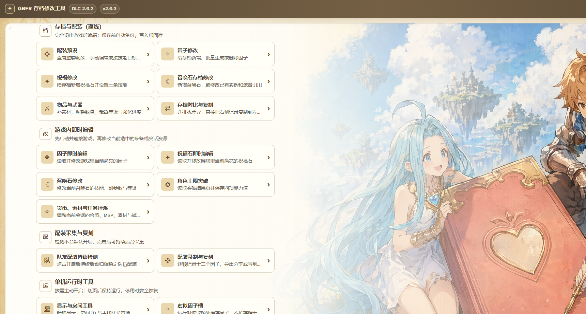
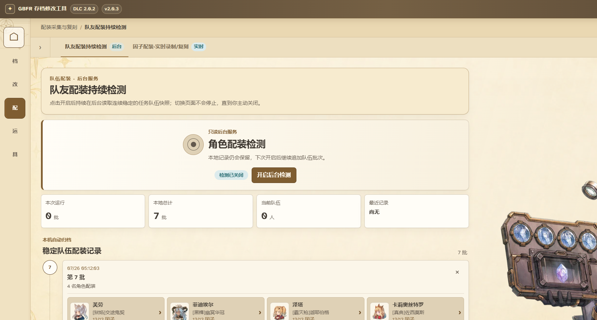
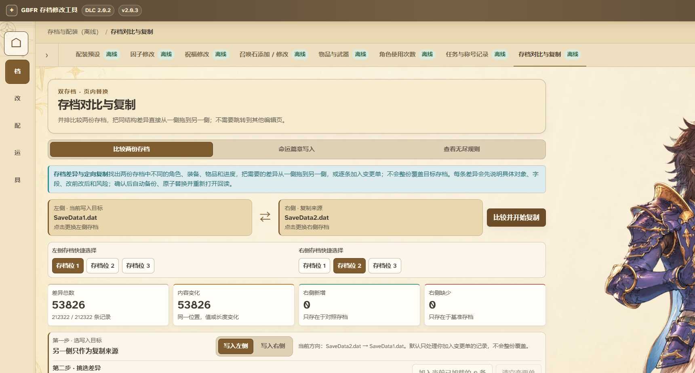
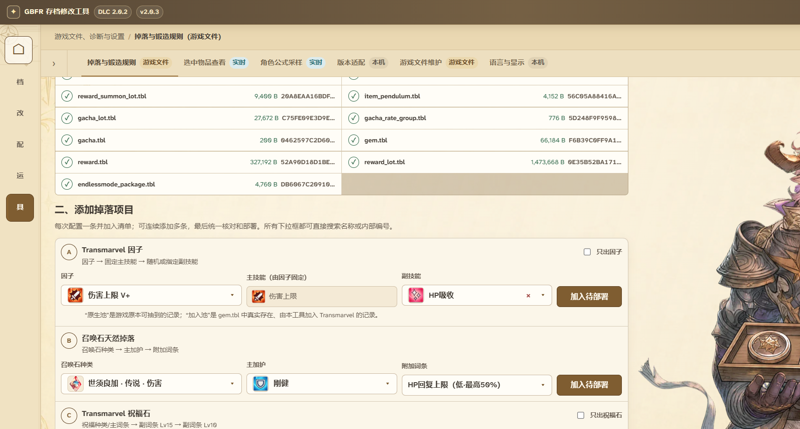

<p align="center">
  
</p>

<h1 align="center">GBFR PE Patch Tool</h1>

<p align="center">A Windows save, loadout, and sharing utility for Granblue Fantasy: Relink 2.0.3, with legacy live features guarded to the verified 2.0.2 executable.</p>

<p align="center">
  <a href="https://github.com/Whitelinker574/GBFR-PE-Patch-Tool/releases/latest"><strong>Download the latest stable release</strong></a> ·
  <a href="https://share.whitelinker.top/?lang=en"><strong>Open the community loadout catalog</strong></a> ·
  <a href="README.md"><strong>简体中文</strong></a>
</p>

## Game 2.0.3 compatibility

v2.0.6 carries forward the completed game 2.0.3 extraction and live-entry adaptation, while correcting stale copy and UI gates that still presented implemented features as unavailable. Natural drops, virtual sigils, audio, town camera, world-axis movement, and gravity suppression now consistently appear as available experimental features.

Embedded catalogs, loadout computation, short codes, QR import, share images, and Logs can continue to use those verified structures. Parsing, atomic writes, and readback also pass on existing real-save copies, but those saves have not yet been resaved and restart-checked by game 2.0.3. Live entry points now select the 2.0.2 or 2.0.3 layout after executable, signature, and original-byte checks; verified install, read-back, and restoration paths are available. Quest results, inventory deltas, and cross-scene effects that still need field evidence remain explicitly experimental instead of being hidden by a blanket legacy-version lock.

See [the primary game 2.0.3 research report](docs/GAME_UPDATE_2.0.3_OFFICIAL_RESEARCH.md) for evidence and remaining field checks.

## What the application is for

v2.0.3 organizes the application around five normal user workflows:

| Workspace | Typical use | Data boundary |
| --- | --- | --- |
| Saves & Loadouts | Edit characters, weapons, sigils, wrightstones, summons, and loadouts; compare two saves | Offline writes with backup, atomic replacement, reopen, and readback |
| Live Editors | Edit the currently selected sigil, wrightstone, summon, or Over Mastery value | Requires the game; every write is bound to the current process and captured object |
| Loadout Capture & Restore | Persistently capture party loadouts, import Logs JSON/databases, and browse battle archives | Capture is off by default and runs continuously only after the user enables it |
| Offline Runtime Tools | Display helpers, room ID, party leader, position, audio, camera, and combat rules | Intended for offline/host use; candidates without field evidence retain an experimental or restoration boundary |
| Game Files, Diagnostics & Settings | Natural-drop rules, read-only sampling, compatibility diagnostics, language, and settings | `data.i` deployment creates a backup and restore path; diagnostics do not write |

The Offline, Live, Read-only, Experimental, and Unavailable labels are functional promises. They describe where data is written, whether a game process is required, and how far the evidence currently reaches.

## Highlights in v2.0.3

### Build a twelve-sigil loadout from skill targets

Smart loadout tools now live directly above the sigil grid in the normal character loadout editor.

<p align="center">
  
</p>

Switch between manual editing and skill-target mode, add any number of skills, and enter the exact target level for each one. Goals are processed from top to bottom. The solver first uses distinct real inventory instances from the selected save, then reports the first target it cannot complete and every missing sigil. Missing instances are never created silently.

A selected result is loaded into the normal draft first. The save changes only after the final write confirmation. The automatic routes cover all 29 playable characters and offer offense, defense, stun, sustain, potion/revive, and dodge-oriented variants. They combine current inventory, character traits, damage-cap references, and recorded 2.0.2 evidence, but they are not advertised as a mathematically proven optimum for every move and battle condition.

### Enable party capture once and keep it running

<p align="center">
  
</p>

Party capture never starts on its own. After you enable it, the service stays active across page changes and waits for three stable snapshots before recording the 2–3 party members it can identify. It stops only when you explicitly turn it off.

The same workspace can parse Relink Logs character JSON, open `logs.db`, browse battle sessions and skill details, preview loadout snapshots, and deploy or publish confirmed candidates. Fields that were not captured remain Not Recorded.

Current-session damage is still labelled a global unattributed observation. Local player, remote player, pet, and summon ownership is not field-complete, so the application does not present the stream as personal DPS.

### Short codes, the public catalog, and share images

Identical immutable loadout frames receive a stable code and are deduplicated by the service. Turning public upload off prevents the loadout from being added to the public directory.

The catalog searches visible character, weapon, sigil, wrightstone, summon, mastery, and skill data. It sorts by newest, name, or likes, and a catalog card can be liked or unliked directly.

The share-image workshop uses a luminous sky-card backdrop with a larger character portrait, weapon, twelve sigils, skill summary, and QR code. It switches between `1920×1080` landscape, `1440×1920` portrait, and `1600×1600` square output. The in-app preview scales to the window while PNG downloads retain their real pixel size. Offline long codes and JSON files remain available when the service cannot be reached.

### Compare and copy between two saves without leaving the page

<p align="center">
  
</p>

The save laboratory explains known differences by category, copyability, and confidence. Equal-shape records with audited semantics can be staged in either direction on the same page. Additions, removals, length changes, and unknown structures remain visible but cannot be copied as raw bytes.

Fate Episodes provide a restricted experimental writer for audited completion values. Reward claiming, dependency flags, and visible in-game results are not claimed as complete. Endless rules remain a bilingual read-only atlas until a safe deployment and gameplay-readback route exists.

### Configure natural drops from embedded 2.0.2 tables

<p align="center">
  
</p>

Summons, Transmarvel sigils, wrightstones, and verified regular-item rewards are selected from exact tables embedded in the application. Users no longer need to find an unpacked table directory. Selections enter a review list before deployment.

Regular items currently target only the verified Endless Mode Forger's Bounty package; this is not a universal quest, enemy, chest, or event drop-rate editor. Real drop and forging outcomes remain a field-acceptance boundary, so the page stays experimental and always provides a `data.i` backup and restore action.

## Improvements retained from v1.92.0

- One-step parsing, preview, scoped deployment, and sharing for Relink Logs single-player, multiplayer, and `playerData` JSON.
- Direct like/unlike actions on catalog cards, with newest, name, and like sorting.
- Page and character artwork loaded on demand, with prefetch and old-frame retention to reduce blank transitions.
- A GitHub download entry and favicon on the public catalog.
- Shared names, icons, skill levels, summons, mastery, and Over Mastery semantics across the app and website.

## Write and recovery rules

Every offline save transaction creates a recoverable backup, edits a temporary file, repairs the checksum, atomically replaces the target, reopens it, and reads the changed fields back.

Live features bind the complete `{PID, creation time}` identity. Before writing, they verify the supported 2.0.2 executable, signature, and original bytes; after writing, they read the target back. Game 2.0.3 is identified and rejected at the shared attach boundary before any legacy runtime write. Stop, disconnect, and application exit restore owned state. F12 provides a central stop and recovery action.

Keep your own copy of important saves. After a game update, do not use live writes until the repository explicitly confirms compatibility.

## Experimental features and current capabilities

Natural-drop and forging deployment, virtual sigils, audio, town camera, world-axis movement, and gravity suppression are implemented and retain usable entry points. The maintainers cannot exercise every character, quest, scene transition, and multi-hook combination, so these features remain marked Experimental. Keep the relevant save or game-file backup, follow the in-app steps, and report the exact gameplay scenario and observed result.

Current-session damage capture records raw source instances, action IDs, damage caps, and pre-cap damage, while the combat catalog exposes character cap tables. Stable identity mapping for the local player, teammates, pets, and summons, plus exact final caps for every move of every character, are not covered by the current implementation. The app therefore does not label global events as personal DPS or present table baselines as final per-action values.

Noclip and camera-relative flight currently have no executable entry point. The implemented spatial features are world-axis movement, in-game arrow-key control, and separately owned gravity suppression. Cooldown tuning, shared charge tuning, candidate party-wide monster damage, and candidate catalog patches continue to follow the availability shown on their own pages. Missing maintainer-side coverage does not lock features that are already implemented.

## Performance and compatibility

- Windows 10/11 x64. Game 2.0.3 static catalogs, loadouts, sharing, and Logs data are verified, and existing real-save-copy transactions pass; a game 2.0.3 save/restart readback is still pending. Live features remain guarded to verified 2.0.2.
- Minimum 960×640 window, with common widescreen layouts and 100%/125%/150% scaling covered.
- Initial code is split by page; loadout solving runs in a cancellable Web Worker.
- Each save-diff input is capped at 64 MiB. Logs files, records, and decompression all have explicit bounds.
- On the reference machine, 50 warm transitions at 960×640 and 1280×800 both measured below 300 ms P95.
- 1,176 browser-shell cases covered 28 destinations, two languages, seven viewport sizes, and three scale factors.

See [the performance baseline](docs/PERFORMANCE_BASELINE.md) for the exact methodology.

## Quick start

1. Download the versioned EXE or ZIP from [GitHub Releases](https://github.com/Whitelinker574/GBFR-PE-Patch-Tool/releases/latest).
2. Open Saves & Loadouts first and verify the detected `SaveData` slot.
3. Exit the game before an offline edit, review the draft, and then confirm the write.
4. For a live feature, start the game, connect from that feature's page, and use Stop/Restore when finished.
5. If the application cannot start, inspect `%LOCALAPPDATA%\GBFR-PE-Patch-Tool\startup.log`.

## Development and verification

```powershell
cd frontend
npm ci
npm test
npm run build

cd ..
go test ./...
go vet -unsafeptr=false ./...
build-windows.bat
```

CI status is available in [GitHub Actions](https://github.com/Whitelinker574/GBFR-PE-Patch-Tool/actions/workflows/ci.yml). Formal Windows packages are created with `tools/package_windows_release.ps1`, which emits the versioned EXE, a ZIP containing the required license files, and a SHA-256 manifest.

## Documentation and notice

- [Complete v2.0.6 release notes](docs/RELEASE_NOTES_v2.0.6.md)
- [v2.0.5 release notes](docs/RELEASE_NOTES_v2.0.5.md)
- [v2.0.4 historical release notes](docs/RELEASE_NOTES_v2.0.4.md)
- [Historical v2.0.3 release notes](docs/RELEASE_NOTES_v2.0.3.md)
- [DLC 2.0.2 implementation status](docs/IMPLEMENTATION_STATUS.md)
- [Formula and evidence boundaries](docs/FORMULAS_2.0.2.md)
- [Third-party notices](THIRD_PARTY_NOTICES.md)

This is an unofficial community project. It is not affiliated with, sponsored by, or authorized by Cygames, SEGA, the game's publishers, or the community authors referenced by the project. Use it only with local files and offline environments you are entitled to control. Do not use it to affect other players or repackage it as a paid modification service.
